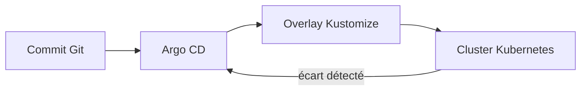

# 4.3 — Git comme source de vérité

Le tag `4.3` ajoute `gitops/argocd/applications.yaml` et la validation du rendu Kustomize.

## Boucle de réconciliation



Argo CD observe l'état déclaré dans Git, l'applique au cluster et peut corriger une modification manuelle grâce à `selfHeal`. Le dépôt devient la source de vérité ; le cluster n'est plus le lieu où l'on édite durablement la configuration.

## Vérification

```sh
kubectl apply -f gitops/argocd/applications.yaml
kubectl get applications -n argocd
kubectl describe application demo-fyc-staging -n argocd
```

Le workflow `validate-manifests.yml` rend les deux overlays sur chaque modification concernée. Il ne déploie aucun cluster et ne remplace pas une revue de sécurité des secrets, des permissions RBAC et de la politique de synchronisation.
